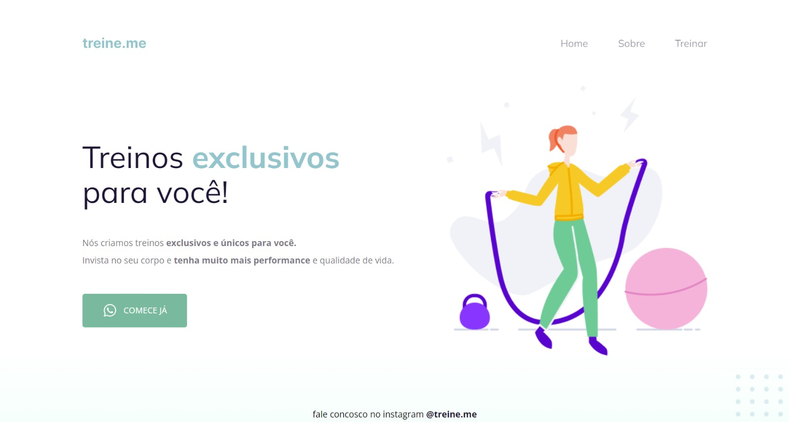

<h1 align="center"> Projeto 02 </h1>

 

  

## Sobre o projeto

Este foi o segundo projeto do curso explorer da rocketseat.   
O projeto foi apresentado e explicado passo a passo em aula.  

## Tecnologias utilizadas

Esse projeto foi desenvolvido com as seguintes tecnologias:

- HTML e CSS
- Github
- Figma